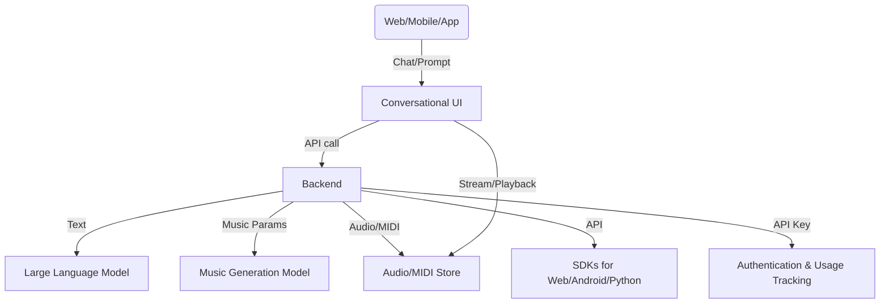

**Key Parts:**
- Conversational UI (web/mobile SDKs)
- Backend orchestrating LLM + music generation model
- Secure, scalable API (auth, usage tracking)
- Audio/MIDI storage and streaming
- SDKs for easy third-party integration